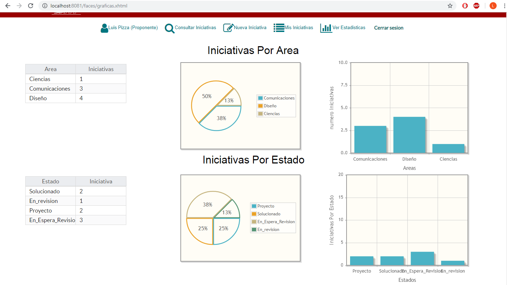

# Plataforma Banco de Iniciativas de Proyectos
 
#  Semestre 2018-2
-   Curso: Proceso de Desarrollo de Software (PDSW)
# Integrantes 

-   Luis  Pizza (Team Develop)
-   Diego Corredor(Team Develop)
-   Francisco Chavez (Product Owner)
-   Cristian Lopez (Team Develop)
-   Nicolas Nontoa (Scrum Master)
#  Descripcion del producto
La Plataforma banco de iniciativas de proyectos de la 	Escuela Colombiana de Ingeniería   es una herramienta donde la comunidad Universitaria pueden exponer y registrar sus ideas Y/o iniciativas sobre un proyecto que crean que se debe de poner en marcha para el beneficio de  la comunidad.  se podrá tener un seguimiento continuo sobre las iniciativas registradas y mostrar iteres por las mismas entre otros servicios  que ofrece. 
## Funcionalidades 
-   Rol de Administrador
-   Rol de Proponente
-   Rol de Usuario Publico
###  Administrador
las funcionalidades relevantes que este rol posee son: 
consultar modificar el estado de las iniciativas, así como agrupar y consultar las iniciativas relacionadas. 
Listar los usuarios de la plataforma y cambiarles el "rol" con esto  dado o quitando permisos a dicho usuario.
adicional a lo ya mencionado este posee puede acceder a funciones generales como el reporte de estadísticas y visualizar 
de forma parcial las iniciativas. 
### Proponente
Este rol posee funcionalidades tales como registrar una nueva iniciativa, mostrar interés por las iniciativas realizar comentarios
sobre estas, editar dichos comentarios y demás. adicional a lo ya mencionado este posee puede acceder a funciones generales como el reporte de estadísticas y visualizar de forma parcial las iniciativas.

### Usuario Publico
Este rol es asignado automáticamente a los usuarios que recién se registran en la pagina, solo pueden acceder a las funcionalidades básicas que esta plataforma ofrece. lo mas relevante que se puede destacar es que puede comentar y visualizar los comentarios de una iniciativa. 
## Funcionalidades Relevantes: 
### Consultar todas las iniciativas o si es el caso solo por palabras claves mostrando y permitiendo dar Likes a estas. 

### Consultar un reporte de estadísticas de las iniciativas por área y de las iniciativas por estado. 

### Realizar un comentario a una iniciativa y consultar los comentarios de  la misma. 

 
### Consultar Las Iniciativas que he creado y Poder modificarlas.
 
### Consultar los todos los usuarios de la plataforma y cambiar el rol de estos. 

### Modificar el estado de las iniciativas y visualizar la iniciativas relacionadas de las mimas 
 
# Arquitectura y Diseño detallado
### Modelo E-R
 
### Descripcion de la arquitectura
#### Capas 
- Vista: consiste en todos los elementos que componen la interfaz grafica del usuario, en el proyecto corresponden a los elementos contenidos en Views.
- Controlador: consiste en todos los elementos que conectan al modelo con la vista,en nuestro proyecto se refiere a los managedBean.
- Modelo: consiste en toda la unidad logica e informacion, que en nuestro proyecto se encuentra ubicado en entities.
#### Tecnologia usada
- Para la interfaz grafica se utilizo Primefaces que es un componente OPS para facilitar la creacion y manipulacion de elementos de la interfaz.
- Se utilizo Guice para realizar la inyeccion, esto facilita que sea el mismo gestor quien determine que necesita para crear cada objeto y garantizar su iniacion sin fallos.
- La base de datos es gestionada con un sistema PostgreSQL, que al estar enfocada en objetos-relacional facilita la integracion con Java.
## Descripcion del proceso
#### Metodologia
- Se realizo el desarrollo de la herramienta usando la metodologia de SCRUM, la cual facilita el trabajo en equipo y garantiza que el cliente participe activamente en el proceso para garantizar que el programa se ajuste a lo requerido por el cliente.
- El backlog puede ser consultado en la pagina https://trello.com/b/nr5D1wyK/2018-2-proypdsw-clnd
### Link Heroku: http://proyecto-pdsw-clnd.herokuapp.com/faces/Inicio.xhtml
## Sprints
### Sprint 1

### Sprint 2

### Sprint 3

## Reporte de pruebas y de cubrimiento de las mismas
Para el reporte de pruebas se hicieron diversos bloques de pruebas de aceptacion, probando cada funcionalidad planteada para el proyecto

